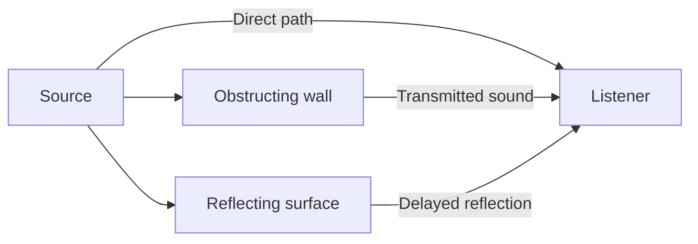

# Audio and scene concepts

These concepts explain the public API. Use the [SDK header](../inc/ia3dapi.h)
and the implementations linked from [architecture](internals/architecture.md)
for declarations and method contracts. Backend support belongs to
[status](status.md).

## Sources and the listener

A source combines audio data with playback and spatial state. A listener
represents the player's listening position, orientation, and velocity. There
is one listener associated with the root object and potentially many sources.

Position answers where a sound is. Orientation answers which way a directional
source or the listener faces. Velocity supplies motion for Doppler calculations.
Choose a consistent velocity convention and update velocity explicitly.

World-relative sources stay in the scene as the player turns. Head-relative
sources are attached to the listener's coordinate system. Native playback
handles audio without the ordinary A3D positional rendering path; it is useful
for content such as stereo music. These modes should be chosen intentionally.

## Directional hearing and HRTFs

A head-related transfer function describes direction-dependent filtering at an
ear. The software renderer selects coefficient rows for the direction of a
source and blends them. Separate gain, delay, and filtering for the two ears
carry more information than stereo panning alone.

The result depends on the coefficient bank, the renderer, the output setup,
and the listener. The presence of HRTF filtering does not guarantee that every
listener identifies every direction correctly. Headphones and speakers create
different physical listening conditions; output mode is part of the rendering
configuration.

## Distance, gain, cones, and Doppler

Gain scales amplitude. Distance attenuation reduces a source's contribution as
distance increases, subject to its minimum and maximum distances and global
scaling. A cone adds directional attenuation relative to source orientation.
These gains combine; increasing one setting can conceal an error in another.

Doppler changes playback rate according to relative motion. Source pitch is an
additional playback-rate control. A units-per-meter setting connects game-space
distances and velocities to the acoustic model. Inconsistent position and
velocity units can produce extreme attenuation or pitch changes.

## Direct sound, occlusion, reflections, and reverb

| Effect | Scene example | Required information |
| --- | --- | --- |
| Direct path | A sound travels toward the listener | Source/listener positions and source controls |
| Occlusion | A wall obstructs that path | Geometry, material transmission, enabled occlusion |
| Reflection | An audible delayed path bounces from a wall | Reflective geometry or a manual reflection |
| Reverberation | Many late arrivals form a decaying tail | Reverb parameters; geometric reverb also uses scene information |

Geometry determines whether the direct path between a source and listener
is obstructed.

A reflection is an individual path with direction, delay, and gain. A reverb
tail is an aggregate effect. Hearing a tail does not prove that wall reflections
are being traced. Similarly, a changing occlusion query does not prove that a
backend applies the corresponding filter to output samples.

Materials describe reflectance and transmittance. Acoustic geometry can be much
simpler than visible geometry: a large wall matters more than its decorative
mesh. A retained list stores reusable geometry commands. The matrix stack
places geometry and binds source/listener transforms.

## Audio frames and sample frames

An A3D scene frame is a batch of state and geometry submitted by the application.
A PCM sample frame contains one sample per output channel at one instant.
They run at different rates. A 60 Hz game can update a renderer producing
thousands of PCM frames per second.

`Clear` prepares geometry for the next scene submission while preserving
loaded audio and persistent settings. `Flush` computes and submits controls.
Audio playback continues independently.

## Logical sources and audible voices

A logical source can exist without an audible [voice](voice.md), the backend
playback instance that renders its sound. The resource manager assigns limited
voices according to its modes and priorities. A source may advance virtually
when no audible voice is available. Source status, capability counts, and
actual output must therefore be inspected separately.

See [game integration](programming/game-engine-integration.md) for applying these
concepts and the [software renderer](internals/software-renderer.md) for the
sample-processing details.
