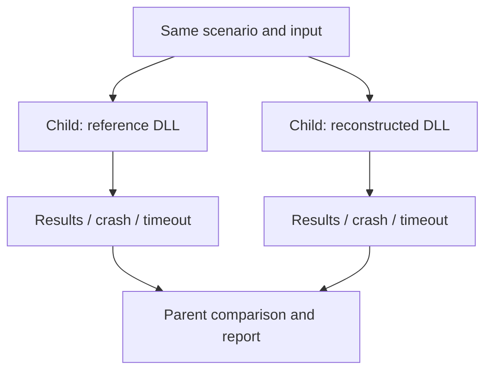

# Testing and interpreting results

Use reference comparisons for original behavior and dedicated extension tests
for emulation. Record the exact DLLs and configuration with every result.

## Test layers

| Layer | Checks | Does not establish |
| --- | --- | --- |
| ABI | PE exports, architecture, vtable lengths | Every method's argument types or semantics |
| API | Return values, output values, faults, ordered state transitions | Audible effects for every accepted state |
| Audio | DirectSound descriptors and captured PCM | Endpoint processing or physical hardware DSP |
| Decoder integration | Adapter loading/decoding paths | PCM equivalence to proprietary codecs |
| Linked integration | Initialization and selected internal behavior | All dynamically loaded client paths |
| Diagnostic audit | Side effects in ASSERT/TRACE/DBGSTR and macro behavior | Complete Debug text/address parity |
| Emulation gate | Quake III-style capability contract and positional PCM | Full-game acoustics |

## Commands and configuration

Build the [reference configuration](building.md#reference-comparison-build).
The exact runner commands and directory contracts are maintained in
[tests/README.md](../../tests/README.md). Common filtered commands are:

```powershell
.\build-reference\Release\a3d_reference_comparison_tests.exe --gtest_list_tests
.\build-reference\Release\a3d_reference_comparison_tests.exe --gtest_filter=AbiVsReference.*
.\build-reference\Release\a3d_reference_comparison_tests.exe --gtest_filter=InterfaceVsReference.ListenerGetters
```

Runtime comparisons select `<build>/Release/a3dapi.dll` by default, including
when the runner itself is Debug. `A3D_COMPARISON_DLL` overrides that path.
Debug ABI inspection uses the matching Debug reference. Missing required files
cause test failures.

## Isolation and ordering



Each branch runs in a separate child process. The runner controls execution
order. Audio scenarios use the same process-local
DirectSound recorder on each side.

Interface comparisons run scenarios in child processes, one per DLL, with
deadlines and streamed results. Reference defects can crash or hang a child;
the parent records that outcome. Some material results depend on allocation
and setup order, so a standalone scenario is not necessarily equivalent to
the ordered suite.

The capture path substitutes DirectSound inside the process. This avoids
global COM changes and gives reproducible output buffers. It intentionally
advertises a software-only device. Hardware acquisition requires separate
validation.
The normal capture deadline is 30 seconds, with a parent allowance of 35
seconds. Test-level timeouts also bound the aggregate runners.

## PCM comparisons

The current static scenes are `default`, `mono`, `right`, `behind`, `native`,
and `pitch`. They cover distinct gain, position, mode, and rate branches.
Comparisons use the common captured PCM prefix and their defined tolerances;
check [reference_pcm_tests.cpp](../../tests/audio/reference_pcm_tests.cpp) for
the current thresholds and sample alignment.

Capture start timing and length can vary. A longer WAV is not automatically
more correct. Compare descriptors, sample format, active buffer state, and
the intended sample interval. For scene logs, compare two reference runs first
to establish which fields are repeatable.

Matching reverb/reflection refusals verify refusal behavior. Validating a
tail or reflected path requires rendered-effect tests. Nonzero PCM and stereo
asymmetry provide basic output checks; acoustic quality needs further measurement.

## Evidence to retain

Keep the commit/dirty state, build/runtime settings, DLL hashes, command, input asset, environment,
test output, and capture manifest. Put transient logs/captures in ignored
`artifacts/`. Record lasting coverage and limitations
in [status](../status.md) without duplicating a session chronology across pages.

Source citation counts measure annotation coverage. They must not be reported
as functional completeness or test coverage. Existing failures and untested
paths are summarized in [status](../status.md).
