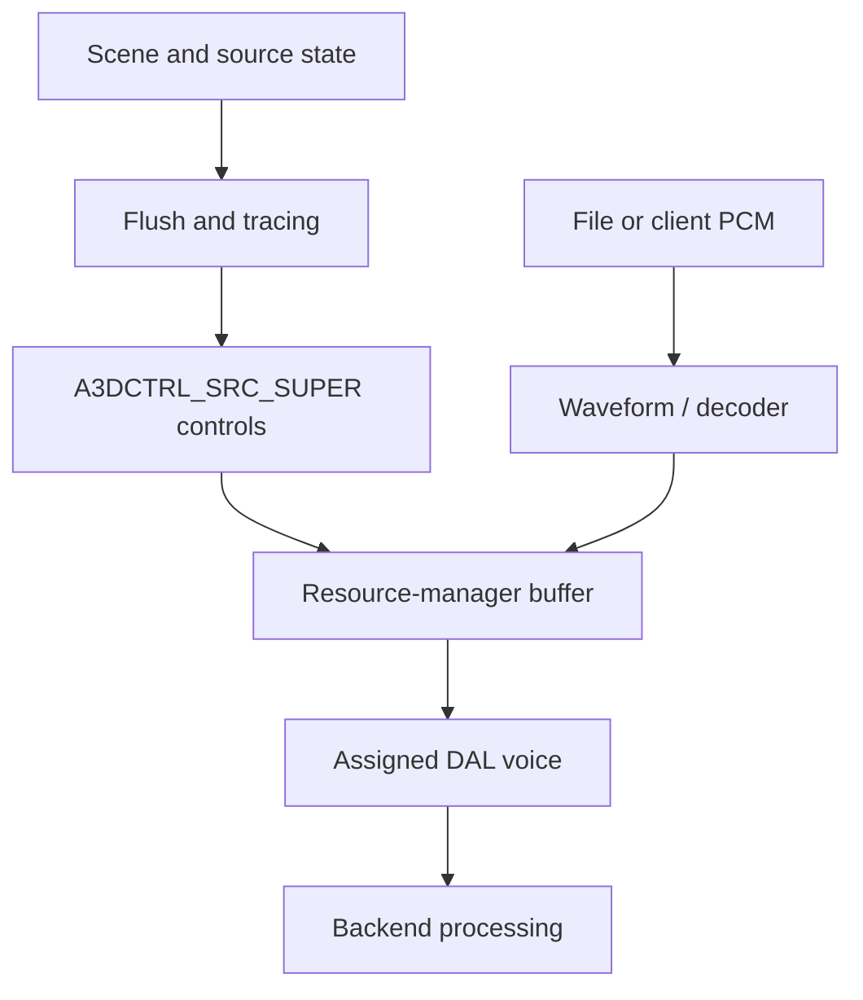

# Implementation architecture

`a3dapi.dll` owns the public scene API and its internal resource manager. The
resource manager selects rendering devices and assigns buffers. The sibling
`a3d.dll` provides a separate legacy entry path.

## Ownership and source map

| Subsystem | Main classes | Source |
| --- | --- | --- |
| Root and activation | `CA3dRoot`, `CA3dClassFactory` | [A3dRoot.cpp](../../src/a3dapi/A3dRoot.cpp), [A3d3.cpp](../../src/a3dapi/A3d3.cpp), [a3dclsfc.cpp](../../src/a3dapi/a3dclsfc.cpp) |
| Source API | `CA3dSourceCom`, `CA3dSource`, `CWaveForm` | [a3dsourcecom.cpp](../../src/a3dapi/a3dsourcecom.cpp), [A3dSource.cpp](../../src/a3dapi/A3dSource.cpp), [Waveform.cpp](../../src/a3dapi/Waveform.cpp) |
| Listener and transforms | Root listener subobject, matrix helpers | [Listener.cpp](../../src/a3dapi/Listener.cpp), [A3dMatrix.cpp](../../src/a3dapi/A3dMatrix.cpp) |
| Geometry and acoustics | Pools, lists, polygons, rooms, walls, openings | [A3dGeom.cpp](../../src/a3dapi/A3dGeom.cpp), [A3dScene.cpp](../../src/a3dapi/A3dScene.cpp), [sceneman.cpp](../../src/a3dapi/sceneman.cpp) |
| Material/effect state | `CA3dMaterial`, `CA3dReverb`, `CA3dReflection` | [MaterialObject.cpp](../../src/a3dapi/MaterialObject.cpp), [A3dReverb.cpp](../../src/a3dapi/A3dReverb.cpp), [A3dReflection.cpp](../../src/a3dapi/A3dReflection.cpp) |
| Resource management | `ResMan`, `ResManBuffer`, static/streaming subclasses, `DalInfo` | [resman.cpp](../../src/a3dapi/resman.cpp), [rmbuffer.cpp](../../src/a3dapi/rmbuffer.cpp), [dalinfo.cpp](../../src/a3dapi/dalinfo.cpp) |
| Rendering | DAL and buffer pairs, `CHrtfMgr`, mixer/output routines | [audio backends](audio-backends.md), [software renderer](software-renderer.md) |
| Legacy DirectSound mapper | `CA3dMapper` | [apimapper.cpp](../../src/a3dapi/apimapper.cpp) |

Source banners give per-function attribution. The [analysis tools](../../tools/README.md)
generate the file map, class map, layout and address reports.

## Root and interfaces

`CA3dRoot` implements `IA3d5`, `IA3dGeom2`, `IA3dListener`, and the private scene
interface as subobjects. It owns source registration, geometry pools, matrix
state, feature masks, and listener state. Initialization attaches it to
DirectSound/A3D device interfaces. Class-factory selection also supports a
DirectSound mapper or a resource manager without a scene root.

The object returned by `NewSource` is a COM wrapper. It selects the ordinary
wave-source implementation or an AC-3 graph route. Source controls, waveform
storage, resource-manager buffers, and actual DAL [voices](../voice.md) are
distinct objects.

## Data flow

Geometry operates on control data. `Flush` updates the controls used during
ongoing playback. The service and mixer threads advance playback between
application submissions. Details are in [frame processing](frame-processing.md)
and [threading](threading-and-synchronization.md).

## Boundaries of the reconstruction

Private DAL interfaces connect the API to device implementations.
Replacement decoders and software effects are separate adaptations. The
original's defects and unknown layouts constrain changes: equivalent-looking
code can violate its ABI, timing, or observable failure behavior.

Use [COM/ABI](com-and-abi.md) for binary contracts and [status](../status.md) for
unresolved implementation work. The detailed 677 locators remain in source
banners.
