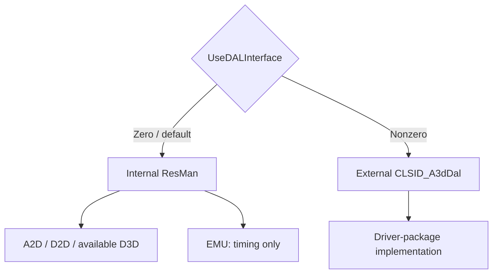

# Audio backends

The resource manager can acquire several device abstraction layers (DALs) and
route different [voices](../voice.md) to different implementations. The
backend determines how source controls become audio. Each backend chapter
below explains its role, processing, playback behavior, and validation limits.

| Backend chapter | Output and limits |
| --- | --- |
| [A2D: software renderer](software-renderer.md) | CPU resampling/HRTF mixing into one looping DirectSound buffer |
| [D2D: DirectSound buffer playback](backend-d2d.md) | Per-voice DirectSound buffers with volume, pan, and frequency; no A3D HRTF filtering |
| [D3D: DirectSound3D and driver controls](backend-d3d.md) | A3D property forwarding or standard 3D buffer controls, selected by buffer support |
| [EMU: virtual playback timing](backend-emu.md) | Playback position and state without audio output |
| [External DALs and the W95 route](backend-external.md) | Driver-package COM servers providing device-specific behavior |

`DAL_EMU` is the timing backend. `EmulateHardware` is a runtime setting that changes
capability reporting. They are separate concepts.

## Top-level route

The class factory reads `HKLM\Software\Aureal\A3D\UseDALInterface`.
A nonzero value activates external `CLSID_A3dDal`; otherwise the factory
constructs the internal resource manager. Both routes attach device interfaces
to the root. The default internal route does not require an external DAL
registration.

The branches identify device providers. Acquisition order and voice capacity
depend on the selected route.

## Acquisition sequence

With software effects disabled, `ResMan::AcquireInterfaces` initializes
COM/DirectSound and attempts an A3D-requiring D3D route, then the
[W95 interface](backend-external.md#w95-acquisition-inside-the-resource-manager)
on failure, then another D3D attempt if W95 also fails.
It subsequently requires A2D, D2D, and EMU acquisition. The last D3D attempt's
result is discarded. On a software-only device the resulting audible route is
normally A2D/D2D with EMU available for virtual timing.

Either `SoftwareReverb` or `SoftwareReflections` skips the
D3D and W95 attempts so the internal route uses A2D for the selected effect.
`EmulateHardware` enables neither effect.
See [compatibility extensions](compatibility-extensions.md) for their behavior.

Render preferences disable selected DirectSound acquisition attempts; they
are translated into resource-manager flags.
The detailed order, descriptor fields, and bit readers are in
[resman.cpp](../../src/a3dapi/resman.cpp) and its source banners.

## Buffer behavior

A2D shares a looping output buffer among mixed voices. D2D uses per-voice
DirectSound buffers. Their capacities belong to the backend declarations and
mode descriptors. Measure end-to-end latency on the intended output route.

`A3DCTRL_SRC_SUPER` reaches each backend's buffer interface. A2D uses it for
ear-specific filtering and controls. D2D reduces direct controls to volume,
pan, and rate. D3D tries the supported property-set path or maps controls to
DirectSound3D. EMU advances time without generating samples.

## Capability emulation and validation

With `EmulateHardware`, software capabilities can be exposed through legacy
hardware queries when no hardware DAL qualifies. Capability queries prefer
qualifying hardware candidates when present; the software-effects acquisition
path above skips those candidates. Capability reporting changes what a client
is allowed to attempt; actual rendering still uses the selected backend.

The software-only recorder deliberately avoids hardware-advertising routes.
An original D3D-buffer destructor null dereference is recorded at
`rtl:0x1001C22C`. DirectSound3D initialization also has exception boundaries
that must be preserved so device-selection failures do not escape the DLL.

See [testing](../development/testing.md) for descriptor/PCM comparisons and
[modern systems](../user/modern-systems.md) for the endpoint beyond DirectSound.
