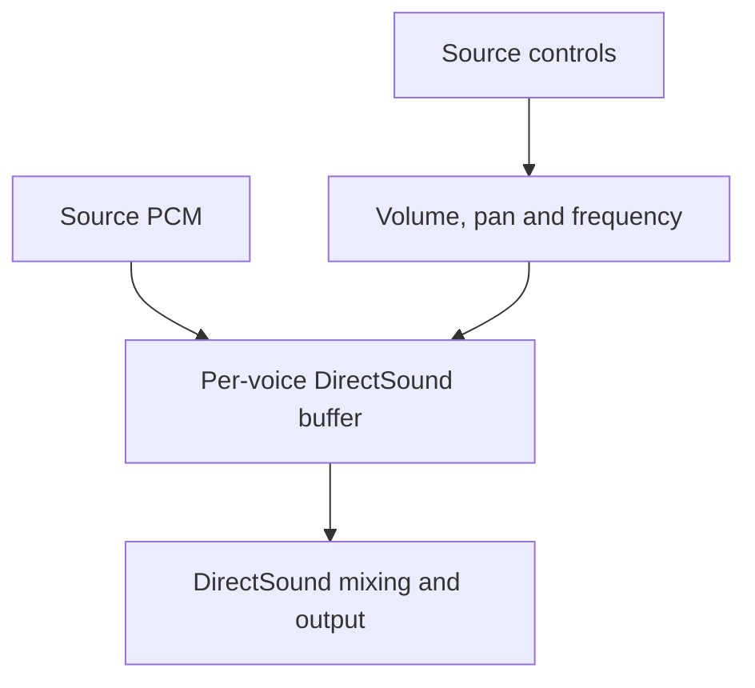

# D2D: DirectSound buffer playback

D2D plays each assigned [voice](../voice.md) through its own DirectSound
secondary buffer. It translates A3D's direct-sound controls into volume,
stereo pan, and playback frequency. DirectSound consumes the PCM and handles
output mixing.

See [Audio backends](audio-backends.md) for acquisition and a comparison with
the other routes.

## Role and selection

The internal resource manager acquires D2D as part of its required device set.
D2D serves its two-channel buffer list, used by the native playback route.
This suits sounds whose placement is expressed through channel balance, such
as a native stereo stream. The game chooses source behavior through the public
API; the [resource manager](resource-management.md) assigns backend buffers.

D2D initializes a DirectSound device and creates secondary buffers with volume,
pan, and frequency controls. Each wrapper retains the format and source
controls associated with its buffer. Acquisition and buffer creation are
implemented in [dal_d2d.cpp](../../src/a3dapi/dal_d2d.cpp).

## From controls to output

The larger ear gain determines the overall volume, and the ratio between ear
gains determines pan. The source frequency factor changes the playback rate.
The conversion uses DirectSound's logarithmic volume and pan representation.
The implementation and its edge cases are in
[d2dbuffer.cpp](../../src/a3dapi/d2dbuffer.cpp).

D2D's spatial processing is limited to these controls. It performs no A3D HRTF
convolution, interaural delay filtering, or reflection rendering. A left/right
level difference can therefore produce directional balance while the richer
filtering described in [A2D](software-renderer.md) remains specific to that
renderer.

## Playback and buffering

The wrapper forwards buffer reads, writes, playback, seeking, and status queries
to DirectSound. Playback cursors follow the underlying buffer. The resource
manager handles the higher-level source lifetime and refill schedule; see
[decoding and streaming](decoding-and-streaming.md).

Buffer size and refill policy affect when data reaches DirectSound. Audible
latency also includes processing after that buffer. The
[modern systems guide](../user/modern-systems.md) describes the platform output
path shared by DirectSound clients.

## Validation and limitations

The native scene in the [audio comparisons](../development/testing.md) exercises
D2D's buffer descriptor and PCM path. Those results apply to the recorded
format, controls, and capture interval. Test playback state and rendered output
together when changing the conversion: the original control submission ignores
individual DirectSound setter failures.

Device declarations are in [dal_d2d.h](../../src/a3dapi/dal_d2d.h), and buffer
declarations are in [d2dbuffer.h](../../src/a3dapi/d2dbuffer.h).
