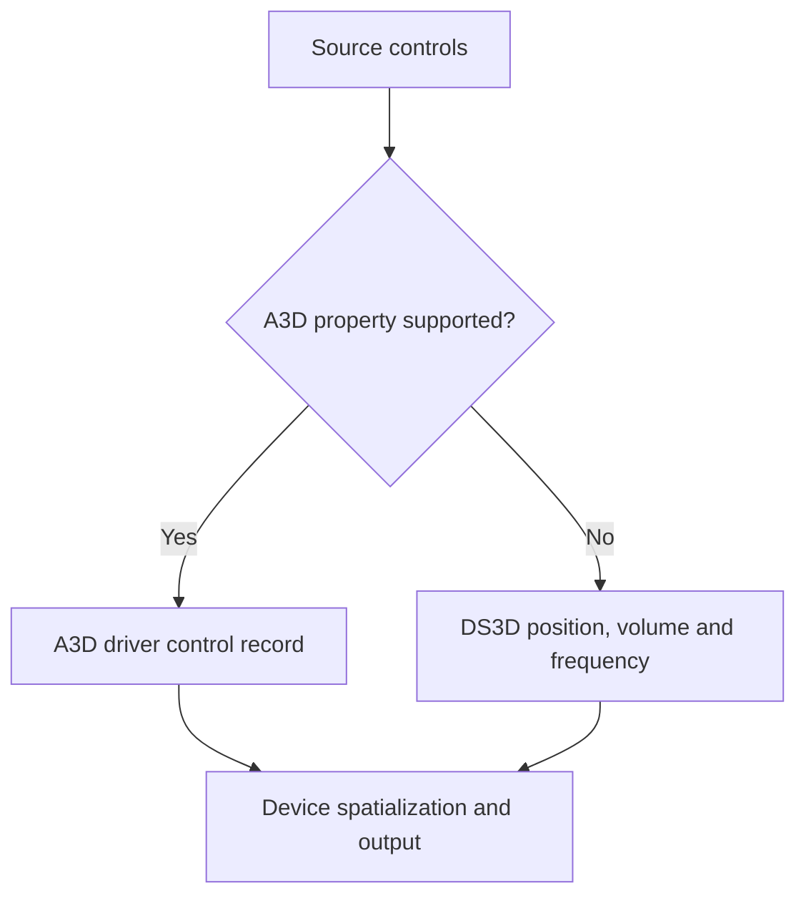

# D3D: DirectSound3D and driver controls

D3D sends source audio and spatial controls to a DirectSound3D device. It can
submit A3D control records through a supported driver property set or express
the direct path through standard DirectSound3D controls. The selected device
implements the resulting spatialization.

See [Audio backends](audio-backends.md) for acquisition and a comparison with
the other routes.

## Device requirements and startup

The device probe requires advertised hardware 3D buffer capacity. Its A3D
probe also checks the driver's property interface. This explains why ordinary
software-only devices fail D3D acquisition and proceed to A2D/D2D.
The acquisition sequence includes an A3D-requiring attempt and a later attempt
that permits the DirectSound3D route, subject to render preferences.

Startup creates a primary 3D buffer and listener. Source [voices](../voice.md)
receive secondary 3D buffers. When requested and supported, reflection
processing also starts a worker that manages reflection voice aging. Device
probing, startup, and shutdown are in
[dal_d3d.cpp](../../src/a3dapi/dal_d3d.cpp).

## Two control paths

The buffer checks property support during initialization. With support, it
forwards the source control record to the driver. Without support, it derives
a head-relative position from the two ear directions and applies volume and
frequency to the buffer. The standard route carries this reduced description
of the direct sound. A2D's per-ear filters are implemented separately in the
[software renderer](software-renderer.md).

The branch depends on the recorded support probe. A later property submission
failure does not automatically switch the voice to standard DS3D controls.
Several delegated failures are ignored in the original implementation, so
successful submission alone provides limited evidence of rendered output.

## Reflected voices

When reflection handling is enabled, the property path can maintain additional
voices for reflected sound. Reflection objects duplicate source buffers, apply
the reflected controls, and synchronize playback using path delay and source
position. Updates create or remove reflection objects as paths become available
or disappear. The worker advances their aging state between updates.

This processing consumes device resources and depends on buffer/property
support. Its implementation is in [d3dbuffer.cpp](../../src/a3dapi/d3dbuffer.cpp).
The project-added A2D effects have their own implementation and selection rules;
see [compatibility extensions](compatibility-extensions.md).

## Modern systems and validation

The DirectSound implementation's reported capabilities determine whether this
backend is acquired. A replacement `dsound.dll` may change those reports and
the downstream renderer; its behavior needs validation for that environment.
See [modern systems](../user/modern-systems.md) for the documented support scope.

The software-only recorder excludes hardware-advertising routes. Recorded A2D
and D2D PCM results leave D3D's driver output and physical DSP behavior
unverified. The original also has a D3D-buffer destruction failure, recorded in the
source banners. Device initialization
retains exception handlers, with a remaining handler-scope qualification in
the source banner.

For a D3D investigation, record the loaded DirectSound provider, device
capabilities, property support, buffer creation, output, and shutdown outcome.
The declarations are in [dal_d3d.h](../../src/a3dapi/dal_d3d.h) and
[d3dbuffer.h](../../src/a3dapi/d3dbuffer.h); the
[testing guide](../development/testing.md) describes reproducible records.
