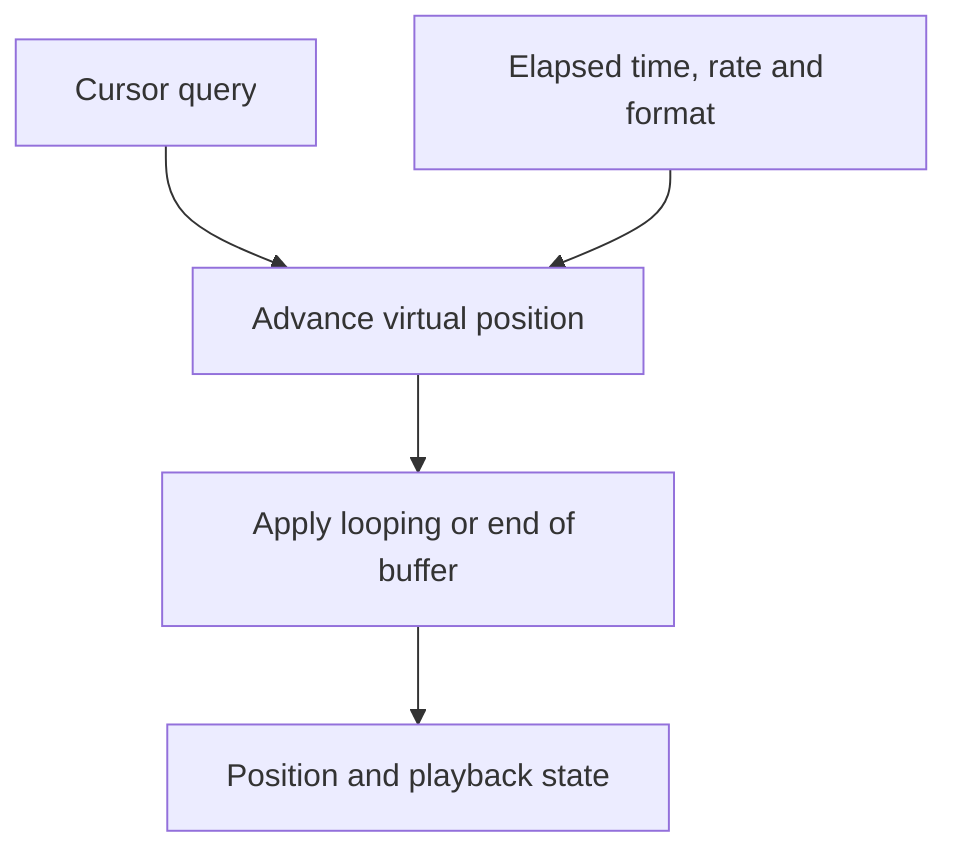

# EMU: virtual playback timing

EMU keeps a playback position and source state for a [voice](../voice.md) that
has no audible backend assignment. It produces no PCM and allocates no
DirectSound output buffer. This lets the resource manager represent eligible
virtual voices while audible capacity is in use.

See [Audio backends](audio-backends.md) for acquisition and a comparison with
the other routes.

## Role in voice allocation

The internal resource manager acquires EMU after the audible software backends.
An eligible positional voice can reach EMU when audible voices are unavailable.
The logical source retains its resource-manager buffer as assignments change.
Priority, capacity, and resource-manager policy govern those changes; see
[resource management](resource-management.md).

`DAL_EMU` owns the virtual buffer list and reports capacity based on its voice
accounting. Each `EMUBuffer` stores playback state, format, position, frequency,
and source controls. Device operations are largely limited to bookkeeping.

## How time advances

Position queries use elapsed `GetTickCount` time and the current playback rate
to calculate progress through the buffer. Looping playback wraps at the buffer
boundary; a nonlooping voice stops when it reaches the end. Starting playback
establishes the timing reference. A status query reads the stored state, while
the cursor query performs the elapsed-time update.

The resource manager can use this state to continue tracking a source's
progress while it is silent. Timing precision and cursor behavior follow the
original implementation, including its documented tick-wrap defect and an
unresolved arithmetic precision comparison. Those details remain beside the
implementation in [emubuffer.cpp](../../src/a3dapi/emubuffer.cpp).

## Data, controls, and notifications

EMU retains controls for timing and bookkeeping. Audio buffer locks provide no
sample storage, and spatial controls produce no filtering or audio output.
Some original operations update stored state while reporting an unsupported
result; their exact contracts are recorded in the source.

DirectSound position-notification registration is unsupported by `EMUBuffer`.
Resource-manager notification handling is implemented separately in
[rmstatbuffer.cpp](../../src/a3dapi/rmstatbuffer.cpp). Event behavior therefore
needs to be checked at the layer the application actually uses.

## Capability emulation and validation

The `EmulateHardware` runtime setting exposes software capabilities to clients
that require legacy hardware reports. Software effects have separate settings.
Its audible rendering uses A2D. EMU remains the silent timing backend in either
configuration. See [compatibility extensions](compatibility-extensions.md).

Validate EMU through timed cursor progression, looping, stopping, and voice
reassignment. A playing status with silent output is expected for an EMU
assignment. Testing audible recovery also requires exhausting and releasing
real voice capacity; see [resource tests](resource-management.md#testing-resource-behavior).

Device behavior is in [dal_emu.cpp](../../src/a3dapi/dal_emu.cpp), with
declarations in [dal_emu.h](../../src/a3dapi/dal_emu.h) and
[emubuffer.h](../../src/a3dapi/emubuffer.h).
