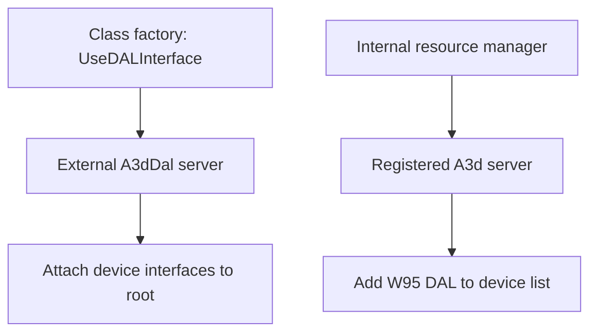

# External DALs and the W95 route

An external DAL supplies device behavior through a COM server installed by a
driver package. This repository reconstructs the code that discovers and uses
that server. The server's internal mixing, DSP, and driver behavior require
separate implementation or reference evidence.

See [Audio backends](audio-backends.md) for the internal backends and their
acquisition sequence.

## Direct external selection

For public root creation, a nonzero `UseDALInterface` registry setting selects
`CLSID_A3dDal` in the class factory. The factory obtains the external device's
DirectSound and A3D interfaces and attaches them to the API root. The external
provider supplies the device layer that the internal resource manager normally
provides.

The diagram shows two entry routes. Selecting the external root route requires
a registered server exposing the expected interfaces. Activation or required
interface-query failure ends that creation attempt. Automatic fallback to the
internal resource manager is absent from this branch.

The registry location and configuration guidance are in
[configuration](../reference/configuration.md). The selection and interface
lifetime handling are in [a3dclsfc.cpp](../../src/a3dapi/a3dclsfc.cpp).
The private resource-manager request used by the sibling library has its own
creation branch; see [legacy bridge](legacy-bridge.md).

## W95 acquisition inside the resource manager

The internal acquisition sequence can also try an external provider through
`CLSID_A3d`. It obtains the legacy A3D interface, queries for a DAL, initializes
it, and adds a `W95` entry to the acquired device list. That entry participates
in resource-manager selection alongside the other acquired DALs.

This attempt follows failure of the first D3D acquisition. If W95 acquisition
also fails, the sequence can continue to the later D3D attempt and the required
software backends. The software-effects build skips these hardware acquisition
attempts, as described in [Audio backends](audio-backends.md#acquisition-sequence).

`W95` identifies this acquisition route. The COM registration determines the
actual provider. Its required DAL support must be established for the installed
server; the presence of a DLL named `a3d.dll` alone is insufficient. The code and its
acquisition evidence are in [resman.cpp](../../src/a3dapi/resman.cpp).

## Rendering and operational limits

The external server owns the device-specific rendering implementation. Its
capability reports, accepted controls, driver communication, and physical
output determine what a game can use. The internal A2D mixer description applies
to A2D assignments; external server processing remains dependent on that server.

On a system configured for the reconstructed software renderer, use the default
internal route. Selecting an unavailable external server prevents initialization.
See [installation](../user/installation.md) for registration and loaded-module
checks, and [modern systems](../user/modern-systems.md) for environment limits.

The repository's software PCM tests leave external DAL output unverified.
Validation requires identifying the COM server and driver versions, confirming
interface acquisition, exercising the requested features, and recording output
and shutdown behavior on that configuration. Preserve those observations with
the [test configuration and DLL identities](../development/testing.md).
