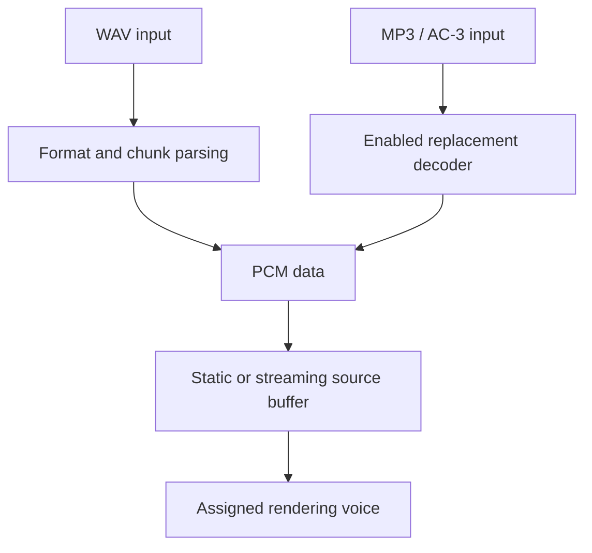

# Decoding and streaming

Waveform loading and streaming feed decoded audio into resource-manager buffers.
The original proprietary MP3 and AC-3 decoder bodies are not reconstructed;
optional adapters provide selected functionality.

## Format routes

| Input | Route | Dependency |
| --- | --- | --- |
| RIFF WAV file or memory image | `mmio`, format/chunk parsing, wave buffer | Windows multimedia APIs |
| MP3 | Mp3Ssc adapter interface | `EnableMP3Decoder=true` for the bundled replacement |
| AC-3 static decoding | Ac3 adapter functions | `EnableAC3Decoder=true` for the bundled replacement |
| AC-3 DirectShow fallback | `Ac3FilterGraph` | A suitable registered system filter and supported initialization path |

Disabled static decoders return their existing unavailable-decoder results. They do not silently
provide another decoder for every call. The DirectShow path is a separate
implementation with its own interface restrictions.

Decoded PCM feeds assigned [voices](../voice.md), which retain playback state
separately from the sample data.

This is the ordinary waveform path. The DirectShow fallback has its own graph
and does not follow this buffer pipeline.

## Source wrapper and decoded format

`CA3dSourceCom` chooses the ordinary source or graph implementation. Ordinary
sources retain file names, decode state, waveform format, and resource-manager
buffers. Encoded metadata reported by `GetCaps` is distinct from decoded
`GetAudioFormat` data. For example, the AC-3 replacement requests stereo output.

The MP3 adapter supplies input, decodes blocks, reports format, signals end of
input, resets, and destroys state. Excess decoded bytes are retained for a
later fill. Several unused interface slots have unresolved callable signatures
and must not be treated as a complete proprietary decoder API.

The AC-3 adapter uses frame synchronization and block decoding. The source
loader performs its own framing/CRC work around the decoder. Loop/reset
behavior belongs to both the adapter and source buffer lifecycle.

## Streaming

Source streaming repeatedly fills segments through callbacks. File position,
decoder position, logical playback position, and the output ring cursor are
different quantities. Seek and duplication restrictions depend on the source
type. `FreeAudioData` still has an unresolved streaming-service teardown path.

Source and resource-manager streaming settings have different limits and
conversions. A source-level buffering request does not necessarily determine
the final device buffer size. Validation and partial-update behavior are
recorded in [A3d3.cpp](../../src/a3dapi/A3d3.cpp) and
[resman.cpp](../../src/a3dapi/resman.cpp).

## DirectShow limits

`Ac3FilterGraph` wraps a system graph and pumps events on a worker. Most source
editing operations return
`A3DERROR_HARDWARE_AC3_OBJECT_DOES_NOT_IMPLEMENT_THIS_MEMBER`. The root's public
`UnlockFallbackAC3Decoder` returns `E_NOTIMPL` in this build.

The failed-load comparison checks lifetime and refusal behavior. It does not
establish successful playback through an installed third-party filter.

## Provenance and validation

The bundled minimp3 implementation is identified as CC0; liba52 is GPL v2 in
the vendored notices. Building with `A3D_FIXES=ON` includes both dependencies even when a runtime
setting disables decoder creation;
retain its notices. This documentation does not infer redistribution rights
for the rest of the reconstruction or the reference binaries.

Decoder integration tests use the supplied MP3/AC-3 fixtures. They do not
compare decoded PCM against Aureal's proprietary codecs. Interface addresses,
adapter methods, and unresolved signatures are preserved in
[the decoder record](../llm/DECODERS.md).
