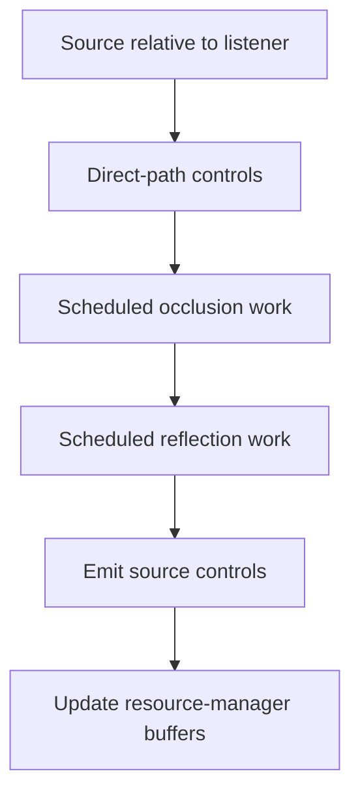

# Frame processing

`Clear` and `Flush` delimit scene submissions. The frame contains geometry and
source/listener control state; PCM playback has its own buffering and timing.

## Preparing and submitting a frame

`Clear` releases extra geometry pools and resets the first when geometry is
ready. It preserves persistent state. An active list recording causes failure.

`Flush` calculates elapsed time from `timeGetTime`, using milliseconds converted
to seconds and retaining the preceding interval when the new value is outside
the accepted 0..5-second range. It traces sources and then submits reverb
changes. It also periodically reads `ref_orders` for a compatibility setting.
See [A3d3.cpp](../../src/a3dapi/A3d3.cpp).

Root interface versions 4 and 5 select `Trace`; earlier versions select
`TraceLegacy`. The latter omits the newer reflection traversal. A client
changing its requested interface can therefore change rendering behavior.

## Control calculation

This summarizes the newer `Trace` path. Feature gates and scheduling can skip
occlusion or reflection work for a source on a given frame.

Direct-path helpers convert positions to polar controls, establish ear state,
compute delays and Doppler, and apply source spread. `TraceWalk` processes
obstructing geometry. `ReflectWalk` constructs reflected candidates;
`ReflectStep` validates them and `CRefAudBin` selects contributions.

`A3dSourceStep`, `A3dSourceStepEnd`, and `A3dSourceEmit` prepare and send
`A3DCTRL_SRC_SUPER`, which carries controls to the rendering layer. The DAL decides how much of it it can implement.

## Scheduling and delayed changes

Tracing work is limited by root trace intervals, per-source counters,
reflection/occlusion update intervals, and a walk limit. An effect can need
multiple repeated frames to stabilize. SceneRooms' settling interval exists
for this reason.

Playback requests may be pending until rendering is enabled or a frame is
submitted. Between submissions, the mixer continues with existing controls.
The resource-manager service thread also schedules [voice](../voice.md)
assignment and refill work independently. The endpoint plays the resulting
samples on its own buffered schedule.

## Fidelity-sensitive arithmetic

The tracing implementation uses reconstructed matrix and fast-math helpers.
`fmath::Init` initializes the square-root table; dropping that initialization
changes numerical results. It uses `VERIFY` so the call survives a Release
build. The original x87 arithmetic and state transitions matter to PCM parity.

Detailed entry addresses are in [the frame record](../llm/ARCHITECTURE.md#frame-update)
and source banners. Remaining traversal gaps are in [status](../status.md).
