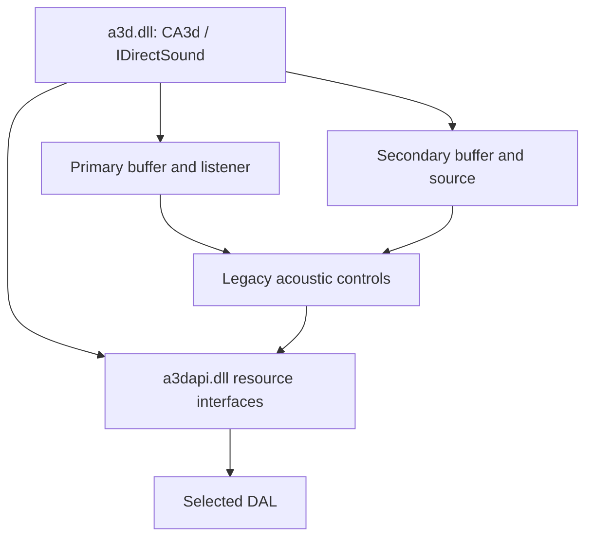

# Legacy bridge implementation

`src/a3d/` reconstructs the separate driver-package A3D 1.x library. It exposes
legacy A3D/DirectSound objects and activates `CLSID_A3dApi` to reach the newer
resource layer.

## Entry points and object model

The DLL exports COM server functions and `_A3dCreate@12`.
`CA3d` provides the root and DirectSound-facing behavior. Primary and secondary
buffers have listener/source interfaces associated with them. The two coclasses
handled by this library are recorded in [its README](../../src/a3d/README.md).

## Source ownership

| File | Responsibility |
| --- | --- |
| [A3d.cpp](../../src/a3d/A3d.cpp) | Root object, creation, buffer factories, splash behavior |
| [Listener.cpp](../../src/a3d/Listener.cpp) | Primary buffer and listener interfaces |
| [dsbuffer.cpp](../../src/a3d/dsbuffer.cpp) | Secondary DirectSound buffer and gain controls |
| [A3dSource.cpp](../../src/a3d/A3dSource.cpp) | Secondary-buffer 3D source interface |
| [a3ddsp.cpp](../../src/a3d/a3ddsp.cpp) | Geometry and DSP control calculations |
| [a3dclsfc.cpp](../../src/a3d/a3dclsfc.cpp) | Class factory and COM exports |
| [Plex.cpp](../../src/a3d/Plex.cpp) | Block allocation |

Source, listener, and factory names overlap with the newer DLL's names.
These are separate classes and must be compiled/reported separately when
establishing layout. `a3dprv.h` contains shared private declarations for this
module. The newer DLL maintains its own private interface header.

## Evidence and limits

This reference does not contain the same Debug assertion/trace/link-table
evidence as the API's 677 Debug build. Filename attribution is inferred from
other evidence. [FILEMAP-A3D](../llm/FILEMAP-A3D.md) records boundaries and
uncertainties.

Always include `a3d.dll` with a binary address because both reference modules
use imagebase `0x10000000`. Each address identifies a location within its
qualified module.

The automated API/PCM suite primarily targets the newer API. Validate legacy
buffer methods, deferred controls, playback, and cleanup through this DLL
before claiming equivalent game behavior. The exact original file identity
is in [reference binaries](../../ref/README.md).
