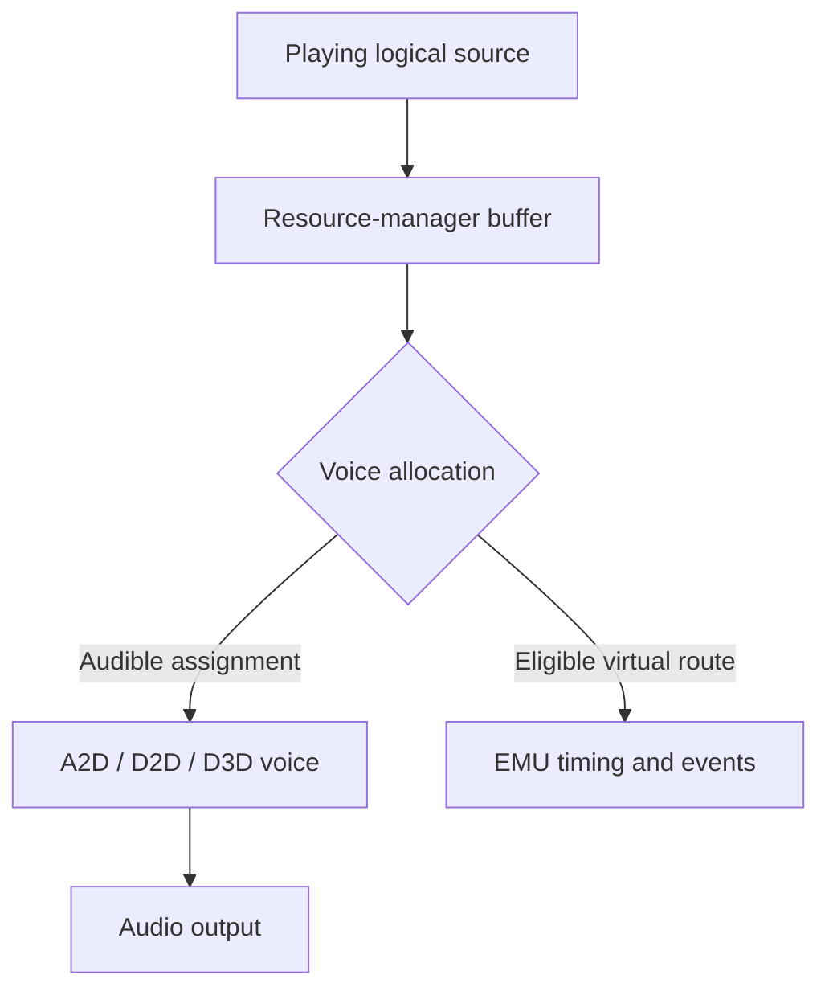

# Resource management

`ResMan` connects logical buffers to acquired DAL devices and services
playback, streaming, property operations, and [voice](../voice.md) allocation.
A source's existence does not imply an assigned audible voice.

## Objects and lists

The manager owns the DAL list, streaming and two-channel buffer lists, and
property-set cache. `DalInfo` holds a device's mode descriptor and buffer
accounting. `DalBufferInfo` links a resource-manager buffer to the current
backend buffer. Static and streaming buffer classes retain source-level state
while a device assignment changes.

Sources refer to `ResManStatBuffer` or `ResManStreamBuffer`, which connect
them to assigned backend buffers. The relevant sources are
[resman.cpp](../../src/a3dapi/resman.cpp),
[rmstatbuffer.cpp](../../src/a3dapi/rmstatbuffer.cpp),
[rmstreambuffer.cpp](../../src/a3dapi/rmstreambuffer.cpp), and
[dalinfo.cpp](../../src/a3dapi/dalinfo.cpp).

## Device and voice selection

Acquisition establishes an ordered set of available devices. The main DAL must
meet the mode requirements used by initialization. Buffer commit passes assign
mode-1 voices from the streaming list and mode-2 voices from the two-channel
list; D2D is the mode-2 backend.

Ordinary positional sources can use [A2D](software-renderer.md) on a software-only
system, with [timing-only EMU](backend-emu.md) as a virtual route when audible
voices are unavailable. Native sources use the [D2D route](backend-d2d.md).
Source priority, resource-manager mode,
priority bias, and capacity limits influence allocation. The exposed counts
must be interpreted with the selected device configuration.

Modes, capacity, and priority determine which assignment is available. EMU
produces no PCM. Reallocation can change the assignment while the logical
source persists.

With `EmulateHardware`, hardware and software capability views can describe the
same A2D pool and share its source limit.
See [audio backends](audio-backends.md).

## Service work

The service thread waits on an event with a timeout. It runs a light pass each
wake and a heavier sequence when the configured interval elapses. Heavy work
includes committing voices, reclaiming released streams, and sorting reflection
priorities. Mixer work runs on its own thread.

Static-buffer wake and stream-refill behavior are part of observable playback
timing. A successful `Play` can precede actual output-buffer writes. Tests should
allow a defined settling interval and record deadlines.

## Property-set cache

Property calls use `CPropertySetItem` records and completion events. Depending
on flags and method, a caller can wait for the service thread to process a
record. Without an assigned device or after property flushing is disabled,
the original can leave a waiter blocked. `FixPropertyDeadlocks` changes selected cases in additions-enabled builds.

Property-set operations depend on record lifetime, cached payloads, completion
events, and service-thread results. See
[property operations](../../src/a3dapi/resman.cpp) and
[synchronization](threading-and-synchronization.md).

## Testing resource behavior

Exercise capacity boundaries, native and positional sources, play/stop cycles,
source release, and device absence separately. Verify source status and PCM
production. A test restricted to one audible source does not validate priority
arbitration or virtual-to-audible transitions under load.
