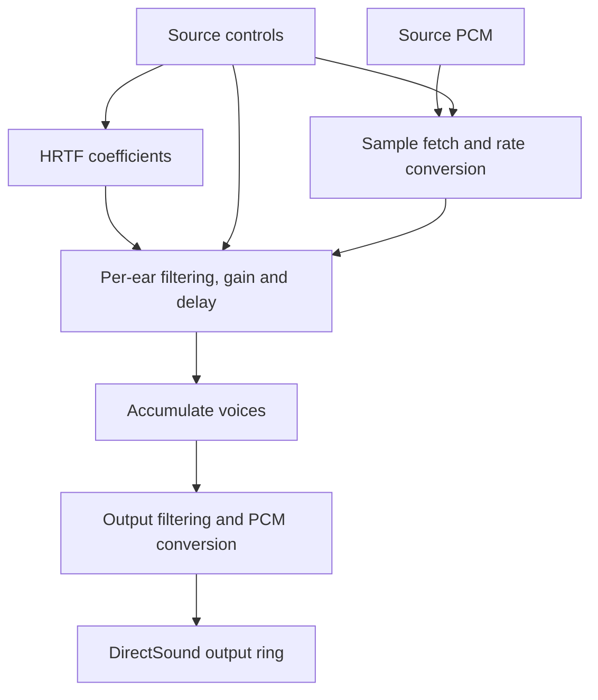

# A2D: software renderer

A2D renders source PCM on the CPU, mixes a stereo output stream, and writes it
to a looping DirectSound buffer. Its HRTF filters and resampler are part of the
reconstruction; optional environmental DSP is separately identified.

See [Audio backends](audio-backends.md) for acquisition and a comparison with
the other routes.

## Role and voice lifetime

A2D provides positional playback on software-only devices. The resource
manager assigns logical sources to A2D [voices](../voice.md) according to
capacity and allocation policy. Each voice retains its own sample position,
rate, gain, and filter history, while the device owns the shared mixer, HRTF
manager, and output buffers. See [resource management](resource-management.md)
for assignment and virtual playback when audible capacity is exhausted.

Device startup creates the looping output buffer and starts the mixer worker.
The worker mixes playing voices, handles released voices, and replenishes
output as DirectSound consumes it. Source control updates and output consumption
run on separate schedules, so a submitted frame can affect a later mixer block.
See [threads and synchronization](threading-and-synchronization.md).

Voice state and playback are implemented in
[a2dbuffer.cpp](../../src/a3dapi/a2dbuffer.cpp), with declarations in
[a2dbuffer.h](../../src/a3dapi/a2dbuffer.h). The remainder of this chapter follows
the processing from source samples to shared output.

## Per-source processing

[softmix.h](../../src/a3dapi/softmix.h) declares playback bounds, source format,
fixed-point stepping, and separate left/right filter histories. The format
bits used by the mixer differ from those in the output-queue code. A sample
frame size determines the conversion between byte positions and frame indices.

Conceptually, each ear receives a weighted sum of filtered source streams:
`ear[n] = sum(sourceGain * filteredSource[n - sourceDelay])`. The actual
implementation combines rate conversion, coefficient transitions, and gain
ramps inside its block routines. The expression describes the signal path;
exact rounding depends on those routines.

The resampler retains fractional read position and interpolates across input
samples, with separate wrapping/tail functions. Playback-rate changes affect
the target step. Per-ear state holds current/target coefficients, increments,
history, and gain. Preserving that state across blocks avoids treating each
block as an unrelated sound.

## HRTF coefficient selection

[CHrtfMgr](../../src/a3dapi/hrtfmgr.cpp) selects a coefficient entry by supported
rate and other keys, maps azimuth/elevation into row indices and weights, and
blends coefficients and interaural delay for each ear. Azimuth wraps; polar
regions use cap behavior. The current table declaration has one coefficient
bank entry; a generic multi-profile selection system should not be inferred.

Direction, mode, rate, and current controls determine the filtering work.
Filter capacities and state are declared in [softmix.h](../../src/a3dapi/softmix.h).

## Mixing and output

The mixer accumulates voices into a shared stereo output buffer. Format,
buffer capacities and voice limits are declared in
[dal_a2d.h](../../src/a3dapi/dal_a2d.h).
These limits do not directly specify measured end-to-end latency or guarantee
an audible voice for every source; assignment and client configuration matter.

`DAL_A2D::MixThread` waits for its event or timeout, inspects the output position,
and refills when needed. Playing voices accumulate into work buffers. Output
filtering, interleaving, and conversion produce the bytes written to DirectSound.
See [dal_a2d.cpp](../../src/a3dapi/dal_a2d.cpp),
[softmix.cpp](../../src/a3dapi/softmix.cpp), and
[outqueue.cpp](../../src/a3dapi/outqueue.cpp).

Native and mono branches differ from positioned HRTF rendering. The six capture
scenes deliberately exercise origin/near-field, mono, positioned right, behind,
native pan, and pitch paths.

## Assembly and numerical contracts

Sample-fetch and step routines use explicit register and x87-stack contracts.
Some functions preserve a different set of registers from an ordinary C helper
because they are internal assembly entry points. Their ABI includes these
register and x87-stack requirements alongside the function pointer declaration.

Fixed-point gain/rate formats, coefficient interpolation, rounding, and history
updates affect sample equality. Replacing them with equivalent-looking modern
DSP can change the result. Read the contracts in `softmix.h` and compare PCM
before changing the arithmetic.

## Optional effects and measurement

Software reflection taps process additional per-voice paths. The software
reverb engine processes shared stereo mix data. They use independent
`SoftwareReflections` and `SoftwareReverb` options,
respectively, and are not recovered hardware DSP.

Use isolated capture to compare the output sent to DirectSound. Windows
endpoint conversion, driver effects, and physical playback occur afterward
and are not measured by that capture. Exact scene/tolerance limits are in
[testing](../development/testing.md).
