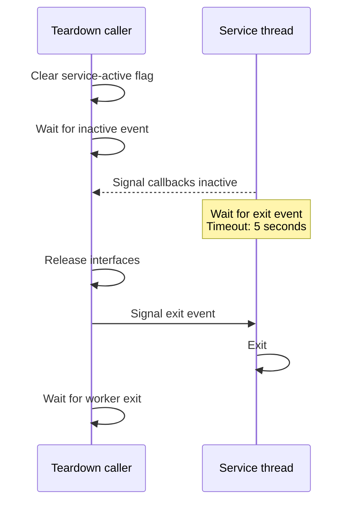

# Threads and synchronization

Scene submission, resource servicing, mixing, and decoding do not all execute
on the caller's thread. Correct teardown must stop work and release objects in
the order expected by the workers.

| Worker | Owner/start path | Work |
| --- | --- | --- |
| `ResMan::ServiceThread` | Resource-manager initialization | Buffer assignment, stream service, property callbacks, reclamation, reflection priorities |
| `DAL_A2D::MixThread` | A2D initialization | Mix playing [voices](../voice.md) and refill the shared output ring |
| D3D reflection thread | D3D private startup | Age/update per-voice hardware reflection buffers |
| `StreamingCallback` | Ordinary source streaming | Refill decoded/sample data |
| `Ac3FilterGraph::EventThreadProc` | DirectShow source | Consume graph events |

Entry addresses are in the source banners.
Implementations are in the resource manager, backend, source, and graph files.

## Independent schedules

The service thread and mixer use separate events and timeouts. Source control
submission can therefore complete before a new voice is assigned or new PCM
is written. The service loop's light/heavy passes also have different cadences.
Tests must distinguish an expected scheduling delay from an indefinite wait.

`Flush` performs scene computation on the caller's path. Complex geometry can
increase game-thread work even when sample mixing runs independently.

## Property-set waits

The cache queues property operations and uses events to return results to
waiting callers. The original can stop flushing after a failed property-set
acquisition or leave a buffer without a DAL assignment. A waiting call can then
remain blocked forever.

`FixPropertyDeadlocks` in an `A3D_FIXES` build skips a wait when manager property flushing has been disabled and
signals the buffer completion event on the no-DAL branch. These changes have
different semantics from repairing every concurrency problem in the library.
See [compatibility extensions](compatibility-extensions.md).

## Teardown handshake

Resource-manager teardown clears the service-active flag and waits for the
worker to signal that callbacks are inactive. The worker then waits up to
5 seconds for the exit event, which teardown signals after releasing
interfaces. Destroying locks, events, or device objects before this handshake
completes can leave a worker using invalid state.

The diagram shows normal completion. The caller's inactive-event and
thread-exit waits also use 5-second timeouts, with `VERIFY` diagnostics; they
do not establish that the worker has finished after a timeout.

Ordinary source events and stream buffers have their own lifetimes. The
unresolved streaming cleanup path requires dedicated lifetime tests.

## Application and diagnostic practice

Use one controlled scene-submission path unless concurrent access has been
established for the particular objects. Do not infer universal thread safety
from the presence of a critical section or interlocked reference count.

For a hang, preserve the last completed API call and sample all relevant thread
stacks. The diagnostic sampler briefly suspends inspected threads and can
perturb timing. Run reference failures in bounded child processes, especially
with Debug builds that can display assertion dialogs. See
[diagnostics](../development/diagnostics.md).
