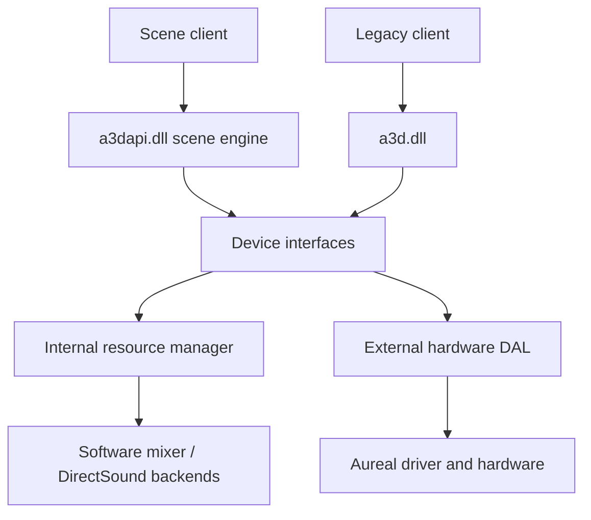

# What A3D does

A3D combines a positional audio API with an engine that turns a description of
sound sources, a listener, and acoustic geometry into audio. A game supplies
recorded sounds and scene information. A3D calculates how those sounds should
change with position, movement, and supported environmental effects.

A gunshot behind the player needs more than a stereo balance adjustment. Its
direction affects the filtering and delay at each ear. A wall between the
player and the gunshot can attenuate the direct sound. A nearby surface can
produce a delayed reflection. These are separate calculations and can have
different support on the selected output backend.

## Components in this repository

| Component | Responsibility |
| --- | --- |
| `inc/ia3dapi.h` | SDK interface declarations, identifiers, structures, flags, and errors |
| `a3dapi.dll` | COM objects, source state, geometry, resource management, software mixing, and device routing |
| `a3d.dll` | Older A3D and DirectSound-facing client interface, connected to `a3dapi.dll` |
| DirectSound | Output devices and buffers supplied by Windows or a replacement implementation |
| External Aureal DAL/driver | Historical hardware interface; the driver and Vortex DSP are outside this reconstruction |
| Samples and tools | Interactive examples, initialization probes, PCM capture, and binary analysis |

The diagram shows the system components. The external DAL is an alternative
to the internal resource manager. Legacy calls can reach the
resource layer without passing through the newer scene engine. See
[implementation architecture](internals/architecture.md) and
[audio backends](internals/audio-backends.md) for those boundaries.

## API generations and the reconstruction target

The repository targets the 3.3.677.0 API binary, with Retail, Debug, and
DebugViewer references. Version 3.3.678 is available for cross-checks. The
sibling `a3d.dll` has its own reference identity. Evidence applies to the
specific reference build. Exact files and
hashes are in [reference binaries](../ref/README.md).

Interface names do not directly encode the marketing release number. The
3.0 SDK exposes `IA3d5` and `IA3dSource2`; older root interfaces remain relevant
because games request them explicitly. The [API overview](programming/api-overview.md)
explains interface selection; [ia3dapi.h](../inc/ia3dapi.h) declares each version.

## What the game supplies

A client initializes an A3D object, selects features, creates sources, and loads
audio. It updates the listener and sources as the scene changes. Games using
environmental acoustics also submit simplified geometry and materials. A frame
submission through `Flush` calculates and commits new rendering controls.
Audio buffers continue playing between game frames.

A3D does not discover a game's graphics geometry, replace its sound engine
automatically, or add acoustic effects to a game that never requests them.
A game that only submits positions provides less information than a game that
also submits walls and materials.

## Running without Aureal hardware

The implementation includes a CPU renderer that filters and mixes sound into a
DirectSound buffer. Optional emulation lets some games pass historical hardware
checks. Separate settings enable project-added software effects. This does not reconstruct
the original card's DSP. Read [modern systems](user/modern-systems.md) and
[status](status.md) before interpreting a successful game launch as full
hardware equivalence.
