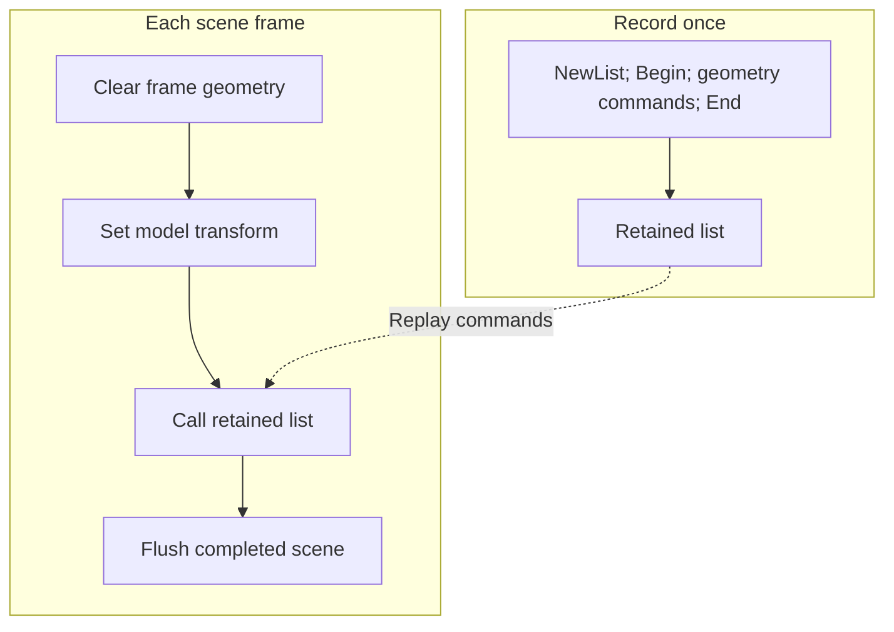

# Acoustic geometry and materials

Submit simplified surfaces that affect sound, with explicit transforms and
materials. A3D does not obtain the rendered scene from OpenGL or Direct3D.

## Frame submission

A typical scene frame calls `Clear`, places the listener and sources, submits
geometry or calls retained lists, and finally calls `Flush`. `Clear` removes
frame geometry while retaining state such as matrices and material selection.
Reset or restore those states deliberately.

`IA3dGeom2` supplies an immediate-mode interface: `Begin`, vertices/normals,
tags and related state, then `End`. Modes include lines, triangles, and quads.
Vertex counts and primitive validity must match the chosen mode. The engine
can reject degenerate or unsupported input.

Conceptual sequence; check every HRESULT in application code:

```cpp
root->Clear();
geom->LoadIdentity();
geom->BindMaterial(wallMaterial);
geom->Begin(A3D_QUADS);
geom->Tag(1);
geom->Vertex3f(-5, -2, -5);
geom->Vertex3f( 5, -2, -5);
geom->Vertex3f( 5,  2, -5);
geom->Vertex3f(-5,  2, -5);
geom->End();
root->Flush();
```

This example submits one surface. Winding, normals,
placement, and the source/listener sides determine how a surface participates
in tracing. The box fixtures in [capture_session.cpp](../../tools/capture/capture_session.cpp)
and [SceneRooms](../../samples/SceneRooms/SceneRooms.cpp) provide complete scenes.

## Materials

Create an `IA3dMaterial`, set both reflectance and transmittance, and bind it
before submitting surfaces. Each setter takes broadband and high-frequency
gain parameters. Initialize both explicitly: the reconstructed material
constructor preserves uninitialized high-frequency fields from the original.

Set material coefficients explicitly. Several persistence/preset entries
return unsupported results in this target. Consult [MaterialObject.cpp](../../src/a3dapi/MaterialObject.cpp).

## Matrices and lists

Matrices are 4x4 and column-major. `PushMatrix`/`PopMatrix` preserve placement
around a model; `LoadIdentity` starts from a known transform. Translations,
rotations, and scales operate on the current matrix. Bind the listener/source
at the intended transform and balance stack operations.

Use `NewList`, `IA3dList::Begin`, geometry commands, and `IA3dList::End` to record
reusable commands. `Call` submits a recorded list. `EnableBoundingVol` must be
set before recording. Avoid unbalanced recording and do not call `Clear` or
`Flush` while a list is recording.



The retained commands survive `Clear`; their submitted frame geometry does
not. Call each needed list again under its current transform.

## Selecting acoustic work

Feature requests at initialization, geometry enable flags, polygon render
modes, and source render modes are separate gates. Enable occlusion or
reflection work at the appropriate levels and check availability. Quality and
update-interval controls trade work for how often tracing refreshes.

Use stable surface tags for the same logical surfaces. Keep geometry coarse
enough to update regularly, and measure scene-submission time separately from
mixer time. Repeated identical frames can be necessary for tracing schedules
and reflection selection to settle.

## Rooms, openings, and implementation limits

The internal engine includes rooms, walls, openings, builders, and scene
validation. The public header only forward-declares `IA3dEnvironment`, and
environment creation/binding entries are unsupported in this reconstruction.

Room transitions, hit refinement, and volumetric integration have unresolved
work. Read [geometry internals](../internals/geometry-engine.md) before extending
those paths. A method accepting geometry does not by itself establish a
correct acoustic result.
