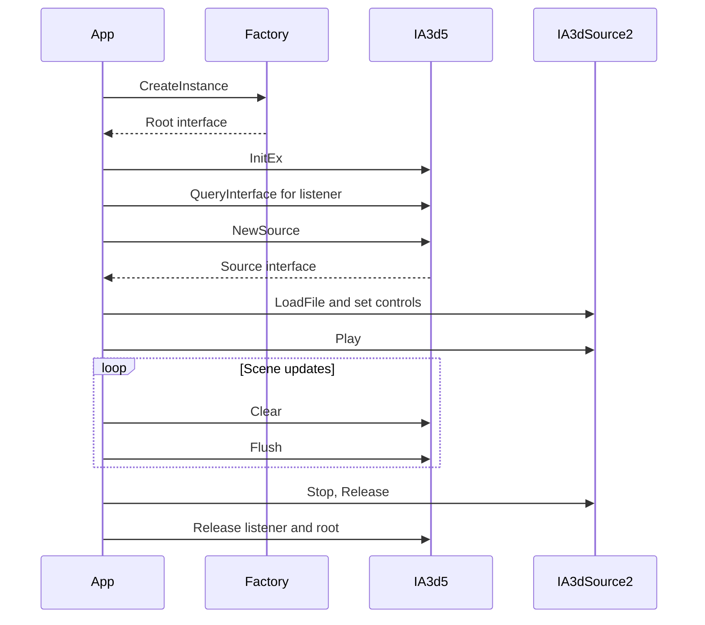

# First A3D application

The accompanying [first-application.cpp](first-application.cpp) loads a specified
DLL, creates `IA3d5`, loads a WAV, positions it to the listener's right, and
submits frames for 3 seconds. It uses a normal application window and checks
each operation. It does not change COM registration.

The code is organized into six commented stages: load the DLL, initialize A3D,
place the listener, load the source, submit scene updates, and release resources.
Setup failures use a shared cleanup path so acquired interfaces are released.

## Build and run

From an **x86 Native Tools Command Prompt for Visual Studio**, at the repository
root, run:

```bat
cl /nologo /EHsc /W4 /MT /I inc docs\programming\first-application.cpp /Fe:build-game\first-application.exe /Fo:build-game\first-application.obj /link ole32.lib user32.lib
build-game\first-application.exe build-game\Release\a3dapi.dll samples\data\Heli.wav
```

Build the DLL first using [getting started](../user/getting-started.md). The
example produces audio. Its window can be closed to stop early. Use a WAV for
the first run so optional decoder availability is not involved.

## Call sequence



The sequence starts after `DllGetClassObject` has returned the factory. It
groups setup calls and cleanup; the complete example also releases the factory
and performs the rendering-enable call described below.

The example explicitly calls `Compat(1000, 1)`, the rendering-enable mode used
by the project's capture path. This is a target-specific behavior established
in [A3dRoot.cpp](../../src/a3dapi/A3dRoot.cpp). A client's negotiated interface
version can affect compatibility defaults.

## Extend the example

Update source and listener state before `Flush`. To add geometry, query
`IA3dGeom2` and submit the scene after `Clear`; see
[acoustic geometry](acoustic-geometry.md). For streaming, choose the
appropriate source/loading flags and follow
[sources and playback](sources-and-playback.md).

The example releases child interfaces before the root and uses ordinary
reference-counted cleanup. Explicit `Shutdown` deletes the root immediately
in this target. Detailed ownership rules are in
[initialization and lifetime](initialization-and-lifetime.md).
