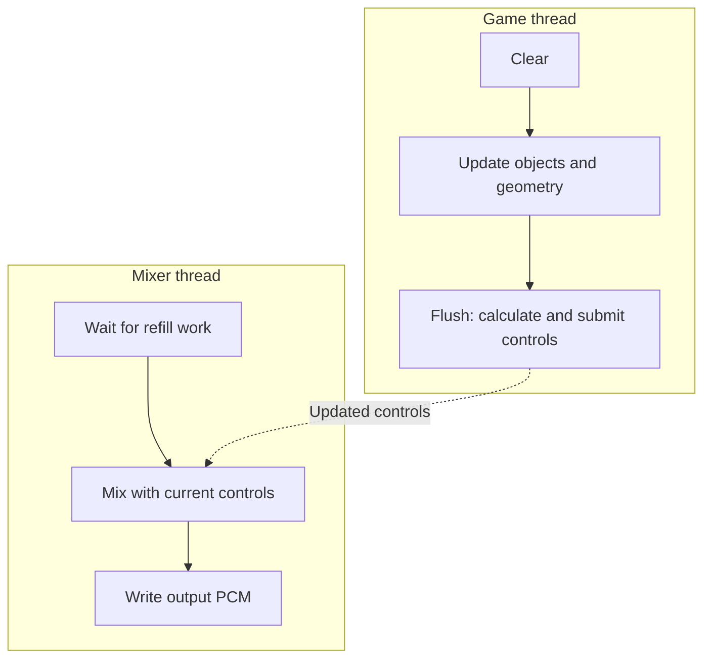

# Integrating A3D into a game engine

Keep the game responsible for sound intent and scene data. Use A3D to maintain
playback objects, calculate supported acoustic controls, and render them.

## Initialization and fallback

Create one root for the audio subsystem. Negotiate the interface version,
initialize with the game window, request the effects the engine can supply
data for, and inspect capabilities. Distinguish an unavailable optional effect
from failure of basic playback.

Record the selected route and feature results in the game's log. Where the
game has another sound path, choose fallback explicitly. Do not let both paths
play the same logical event. New clients can use software capabilities;
hardware-only checks inherited from old clients are handled separately by
[compatibility emulation](../internals/compatibility-extensions.md).

## Map game objects to audio objects

| Game concept | A3D representation |
| --- | --- |
| Camera or controlled character | Listener position, forward/up vectors, velocity |
| Moving engine, weapon, character voice | Source plus entity transform and velocity |
| UI sound or stereo music | Deliberately selected non-positional/native source |
| Repeated sound asset | Reusable waveform/eligible duplicated sources with independent playback |
| Static walls and large obstacles | Simplified geometry with materials and stable tags |
| Moving acoustic model | Geometry list submitted under its current transform |
| Environmental effect | Bound reverb or supported geometry-derived effect |

Keep logical event ownership separate from an audible hardware/software
[voice](../voice.md). A source that loses a rendering voice can still
represent a live looping sound.

## Frame loop

1. Collect gameplay audio events and entity transforms for one simulation time.
2. Call `Clear` for a new geometry frame.
3. Update listener position, orientation, and velocity.
4. Update live sources and issue start/stop requests.
5. Submit acoustic geometry or retained lists, including transform bindings.
6. Call `Flush` once the scene is coherent.
7. Read status needed for event management and retire finished sources.

Loaded data and source state persist across these frame updates. The mixer and
streaming workers continue between submissions.

The groups repeat on independent schedules. The dotted arrow represents
control updates reaching the independently scheduled mixer through
resource-manager/backend state. Resource servicing is
another worker, described in [threading](../internals/threading-and-synchronization.md).

## Asset and geometry preparation

Use explicit format metadata and distinguish encoded from decoded data.
Short effects can use static buffers; long content can use streaming if its
path is supported. Do not allocate, decode entire files, or rebuild all static
geometry in every frame without measuring the cost.

Create an acoustic representation of major surfaces. Small visible details
need not become individual sound polygons. Preserve material identity and
surface tags across frames. Test doors and moving obstacles with known direct
and reflected paths to verify the geometry's acoustic orientation.

## Resource budgets and scheduling

Use source priority and the resource-manager controls according to the target's
semantics. Reported hardware and software capacities may overlap, especially
with capability emulation. Count shared capacity once when budgeting voices.

Measure time spent in `Flush`, worker CPU use, and underruns separately.
Reflection/occlusion update intervals reduce tracing frequency, but make fast
changes less immediate. There is no universal polygon or source budget; keep
measurements tied to scene, format, backend, and build.

Serialize application-side access to scene state unless the particular
interface's concurrency behavior has been established. The implementation's
internal locks do not imply every COM object supports arbitrary concurrent
calls. Avoid blocking work in refill/event handling.

## Pause, level changes, and shutdown

Choose whether pause stops sources, mutes output, or freezes only scene updates.
Stopping calls to `Flush` alone does not stop audio playback. On teleports or
resume, reset velocity estimates to avoid unintended Doppler spikes.

On a level change, stop and release obsolete sources and geometry objects,
then submit the new scene with deliberate matrix/material state. `Clear` is
not full engine reinitialization. On exit, stop application updates before
releasing objects; follow [lifetime rules](initialization-and-lifetime.md).

Validate startup, continuous playback, many simultaneous sources, listener
rotation, map changes, focus changes, and exit. A one-source startup test is
necessary but insufficient for integration coverage.
