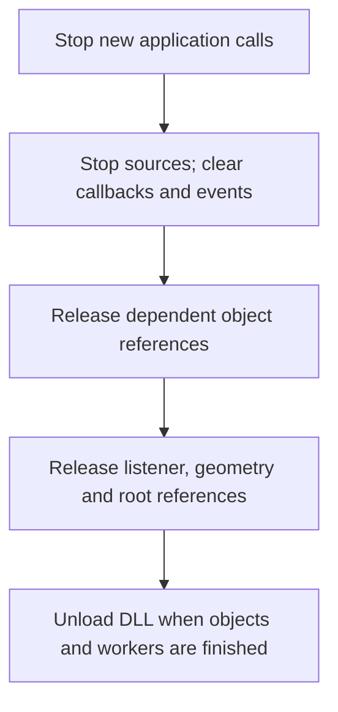

# Initialization and object lifetime

Create the root, initialize the device, acquire the needed interfaces, and
release dependent objects before releasing the root. In this target, explicit
`Shutdown` immediately destroys the root.

## Activation and interface negotiation

The SDK utility path uses `A3dInitialize`, `A3dCreate`, and `A3dUninitialize`.
Their implementation is in [ia3dutil.c](../../samples/lib/ia3dutil.c).
`A3dInitialize` also attempts registration of both DLLs and returns S_OK after
successful COM initialization even if registration fails; inspect DLL selection
separately when using that helper.
An application can instead initialize COM and call `CoCreateInstance` for
`CLSID_A3dApi`, or load an explicit DLL and use its class factory as in the
[first application](first-application.md).

Request an interface the client actually understands. `QueryInterface` provides
the appropriate interface pointer and reference; do not cast a root pointer to
another interface based on an assumed subobject address. Initialization and
feature-query behavior depend on the root interface version. See
[API overview](api-overview.md) and [root declarations](../../src/a3dapi/A3d3.h).

## Initialization arguments

Initialize the output device and establish its relationship to a live game
window. `InitEx` combines those steps; the older `Init` path requires separate
cooperative-level setup. Argument contracts and version-specific validation
are maintained in [A3d3.cpp](../../src/a3dapi/A3d3.cpp).

Feature flags request direct audio, occlusion, reflections, or reverb. Render
preferences influence DirectSound/DirectSound3D acquisition and use a separate
flag family. Inspect hardware/software capabilities after initialization and
initialize the `dwSize` field of sized structures.

For IA3d4/IA3d5, `IsFeatureAvailable` returns Boolean 0/1 despite its HRESULT
declaration. `SUCCEEDED(0)` and `SUCCEEDED(1)` are both true. Older root versions
return `S_OK` or an A3D error. Test according to the negotiated version and
query individual feature bits; the newer implementation checks whether any
requested bit intersects the available mask.

## Ownership

| Operation | Client responsibility |
| --- | --- |
| Successful `QueryInterface` | Release the returned reference |
| Successful `NewSource`, `NewList`, `NewMaterial`, `NewReverb`, or manual-reflection creation | Manage the returned object's reference and owning root/source lifetime |
| Borrowing a pointer for a call | Do not assume ownership transfers unless the method contract says so |
| Binding a material, reverb, or transform | Distinguish the binding's internal ownership from the application's own reference |
| Locking audio data | Unlock the exact returned regions before freeing or replacing storage |

The root, source wrapper, underlying source, waveform, resource-manager
buffer, and DAL [voice](../voice.md) have separate identities and lifetimes.
Duplicated eligible sources share sample data but have independent playback
controls. Streamed sources have duplication restrictions.

## Cleanup and failure

This is the normal `Release` path. Explicit `Shutdown` has a different,
destructive contract described below.

Stop producing new calls, stop sources, clear application callbacks/events as
appropriate, release reflection/source and other dependent interfaces, then
release the listener/geometry/root interfaces. Balance COM initialization on
the thread that performed it. Keep a dynamically loaded server mapped while
its objects or workers can still execute.

`CA3dRoot::Shutdown` increments a guard, marks shutdown, and executes
`delete this` ([source](../../src/a3dapi/A3d3.cpp)). Do not call methods or
`Release` on that root afterward. Dependent objects may also have been
destroyed. New clients should use the reference-counted cleanup path shown in
the example.

Failure does not universally mean unchanged state. Some original setters store
values before returning a mode error. The reference also has incomplete cleanup
on some initialization paths. Check each result, avoid continuing with a failed
construction, and use process-isolated tests for failure-path comparisons.
