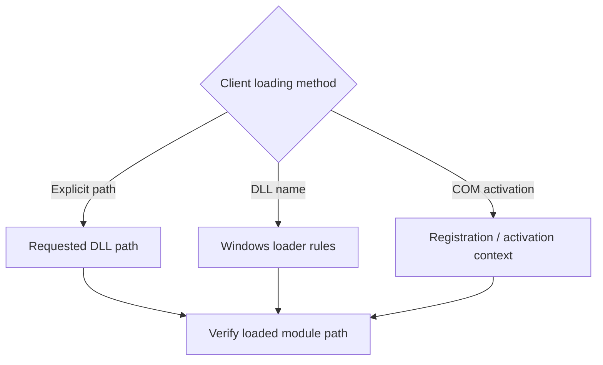

# Installation, DLL loading, and removal

Installation depends on how a client obtains A3D. Establish the loading path
before replacing files or changing registration.

Keep `a3dapi.conf` beside the loaded `a3dapi.dll`, including when COM loads it
from a shared installation directory. Games using that same DLL share its
settings. Restart clients after edits. Back up the configuration alongside the
DLL when replacing or restoring an installation. See
[configuration](configuration.md) for defaults and per-game placement.

## Loading mechanisms



| Client behavior | What selects the DLL |
| --- | --- |
| Loads a DLL by an explicit path | That path, subject to normal loader behavior |
| Imports or loads `a3d.dll` / `a3dapi.dll` by name | Windows loader search rules and any client redirection |
| Creates `CLSID_A3dApi` through COM | The registered in-process server or client activation context |
| Uses this project's explicit-DLL probes | The `--dll` argument and process-local isolation |

The executable directory participates in Windows DLL searching, but redirection
and already-loaded modules can affect selection. Copying a DLL beside a game
does not universally override a COM registration with an absolute server path.
See Microsoft's [DLL search rules](https://learn.microsoft.com/en-us/windows/win32/dlls/dynamic-link-library-search-order).

For a game documented to load local DLLs, close it, preserve any existing copy,
and put the required DLL beside the actual game executable. Some launchers start
an executable in another directory. A3D 1.x clients can also activate
`a3dapi.dll` through the reconstructed `a3d.dll`, so both selections matter.

## Per-user COM selection

The repository helper changes only `CLSID_A3dApi` in the current user's 32-bit
registry view. It accepts these actions:

```powershell
powershell -NoProfile -File tools\configuration\Set-A3dApiServer.ps1 status
powershell -NoProfile -File tools\configuration\Set-A3dApiServer.ps1 reverse
powershell -NoProfile -File tools\configuration\Set-A3dApiServer.ps1 vanilla
```

`reverse` selects `build/Release/a3dapi.dll`, falling back to `build/Debug/`
only if Release is absent. For a custom build directory, use explicit-DLL
loading or configure the registration separately. `vanilla` selects
`ref/a3dapi_33_rtl.dll`. Restore saved values to undo a registration change.
The helper reports the per-user selection; inspect machine registration separately. Its source is [Set-A3dApiServer.ps1](../../tools/configuration/Set-A3dApiServer.ps1).

To use the helper with an emulation build, configure the desired options in
`build`, or use a client that accepts an explicit DLL. Automated comparisons
use process-local registration and do not need this helper.

The DLLs also export `DllRegisterServer` and `DllUnregisterServer`. Their
registration behavior belongs to the original COM server implementation;
running a registration export is distinct from using the per-user helper.
The DLLs are 32-bit. Windows maintains separate views for redirected registry
keys; tools must inspect the correct view. See Microsoft's
[registry redirector documentation](https://learn.microsoft.com/en-us/windows/win32/winprog64/registry-redirector).

## Verify the loaded module

After starting the client, inspect the full module paths in a debugger or with
PowerShell using its process ID:

```powershell
(Get-Process -Id 1234).Modules |
    Where-Object { $_.ModuleName -in 'a3d.dll', 'a3dapi.dll', 'dsound.dll' } |
    Select-Object ModuleName, FileName
```

Replace `1234` with the actual ID. Module enumeration can require matching
process access and an appropriate inspection environment. Check both A3D DLLs
and DirectSound; a replacement `dsound.dll` can change capabilities and routing.
Record hashes with `Get-FileHash -Algorithm SHA256 -LiteralPath <path>`.

## Restore the previous setup

Before registration changes, record whether the per-user key exists and its
values, or export that exact key through a registry editor using the 32-bit
view. The relevant key is
`HKCU\Software\Classes\CLSID\{92FA2C24-253C-11D2-90FB-006008A1F441}\InprocServer32`.

Close clients before restoring files. Restore the saved local DLLs and the
saved registry values. If there was no per-user registration, remove only the
override created for this experiment to reveal the prior machine selection.
Do not substitute `vanilla` for restoring a previously installed third-party
server. Restart the client and verify its loaded path again.
