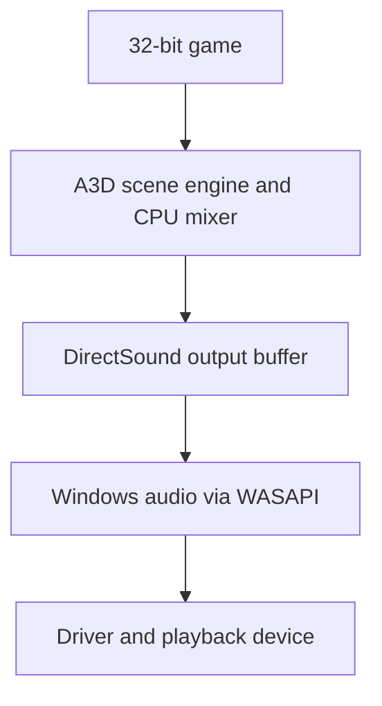

# Modern Windows and other environments

The modern software path runs the reconstructed renderer on the CPU and sends
its output through DirectSound. It does not require a reconstructed Vortex
kernel driver. Historical hardware-dependent features need separate treatment.

## Windows audio path

On Windows Vista and later, Windows routes DirectSound output through WASAPI.
This repository connects to that platform path through DirectSound.
See Microsoft's [audio compatibility note](https://learn.microsoft.com/en-us/windows/win32/dxtecharts/top-issues-for-windows-titles#over-reliance-on-real-time-audio-sample-rate-conversion).

The implementation still uses DirectSound devices, cooperative levels, looping
buffers, and position queries. The final endpoint can mix or resample the
result. A PCM capture inside this project records the DirectSound-facing
samples before processing by Windows or the physical device.

## 32-bit applications on 64-bit Windows

Both reconstructed DLLs target x86. A 32-bit game needs 32-bit DLLs even when
Windows is 64-bit. An ordinary 64-bit process cannot load these x86 DLLs in
process. Microsoft's [process interoperability documentation](https://learn.microsoft.com/en-us/windows/win32/winprog64/process-interoperability)
describes that restriction. The supported build remains x86; layouts, inline
assembly, calling conventions, and vtables constrain a port.

COM registration must use the appropriate registry view. Follow
[installation](installation.md) and verify the actual loaded path.

## Games that require hardware capabilities

Some clients reject A3D before creating a source if `GetHardwareCaps` does not
report the expected flags. `EmulateHardware` exposes the available software
device through those queries when a hardware candidate is unavailable. The
reported software and hardware views refer to the same capacity.

Software reflections and reverb have separate runtime settings. This does not turn a
modern sound card into a Vortex, reproduce the hardware instruction set, or
prove equivalent DSP output. The code paths and constraints are explained in
[compatibility extensions](../internals/compatibility-extensions.md).

## Environment support

| Environment | What is established here |
| --- | --- |
| Windows with software DirectSound output | Implemented software route and automated isolated PCM comparisons; real-device behavior still depends on the client and machine |
| Windows with another `dsound.dll` | An additional compatibility layer; no general guarantee for arbitrary replacements |
| Original Aureal card and driver | Not tested on real hardware; see [sound card hardware](hardware.md) |
| Virtual machine | No established compatibility matrix; guest audio device capabilities determine routing |
| Wine or Proton | No maintained end-to-end result in this repository; do not infer support from Windows tests |
| Windows on ARM | No established project validation; the build still produces x86 code |
| Native Linux/macOS application | No native build target or output backend |

For an unverified environment, record its exact version, client architecture,
DLL selection, DirectSound implementation, initialization result, PCM result,
and shutdown behavior. Do not treat a successful software-only capture as a
test of driver forwarding or all environmental effects.

## Latency and listening comparisons

Latency includes game update timing, resource-manager scheduling, mixer refill,
DirectSound buffering, and endpoint processing. Raising a streaming buffer
length can affect refill behavior but does not provide a direct guarantee of
lower or higher end-to-end latency. No universal modern-system latency figure
is established here.

Compare the same input, scene, gain, build options and runtime configuration, and output setup. Begin with
the project's PCM capture for reproducibility, then test real playback.
Document additional spatialization or audio enhancements as part of the setup.
